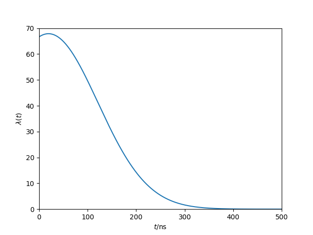
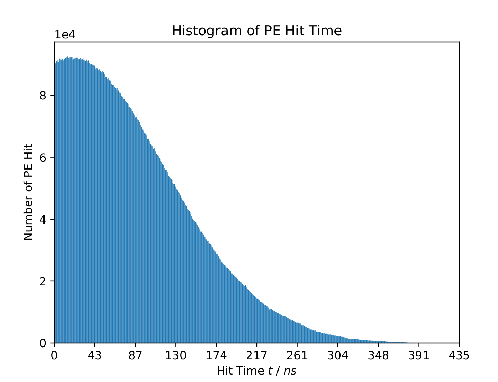
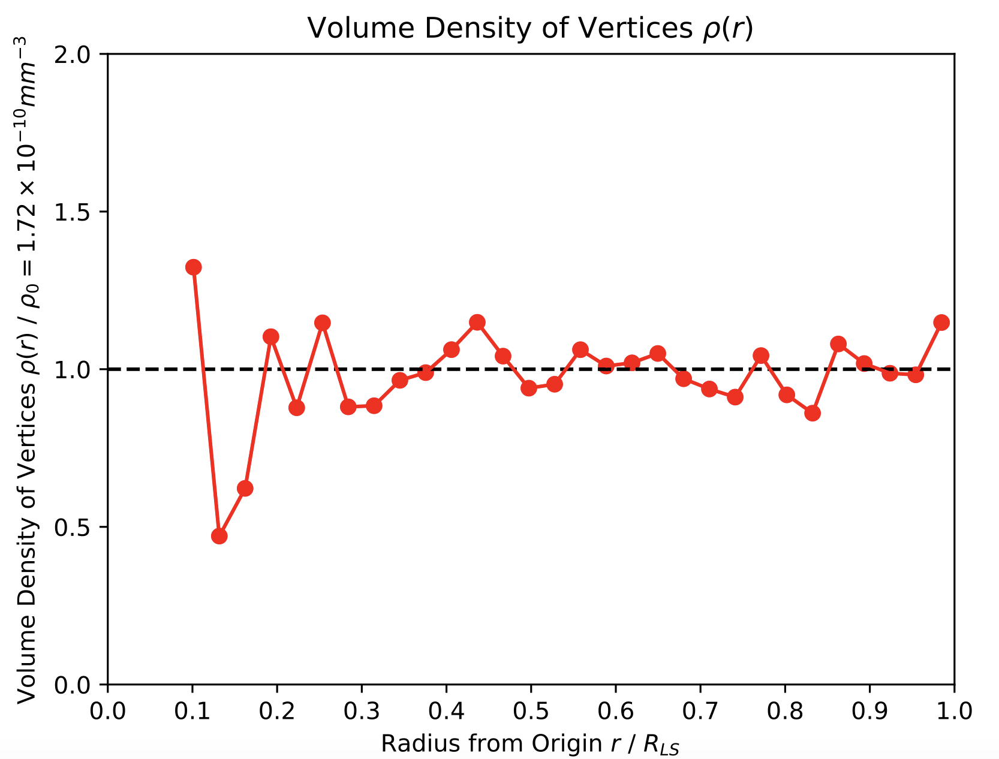
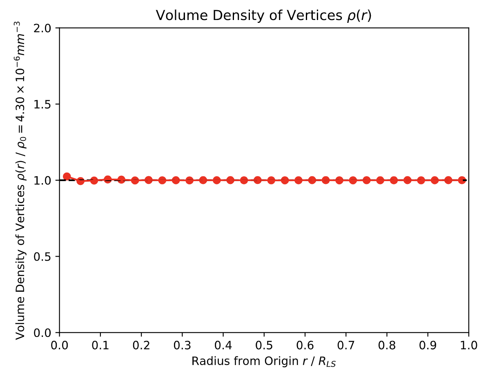
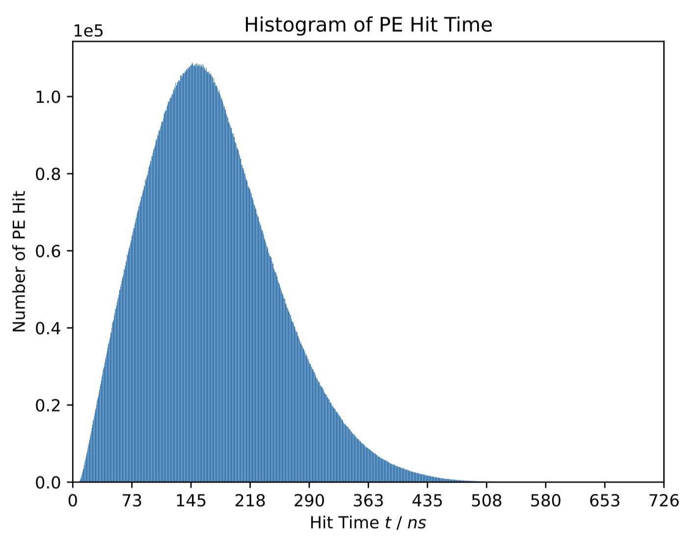
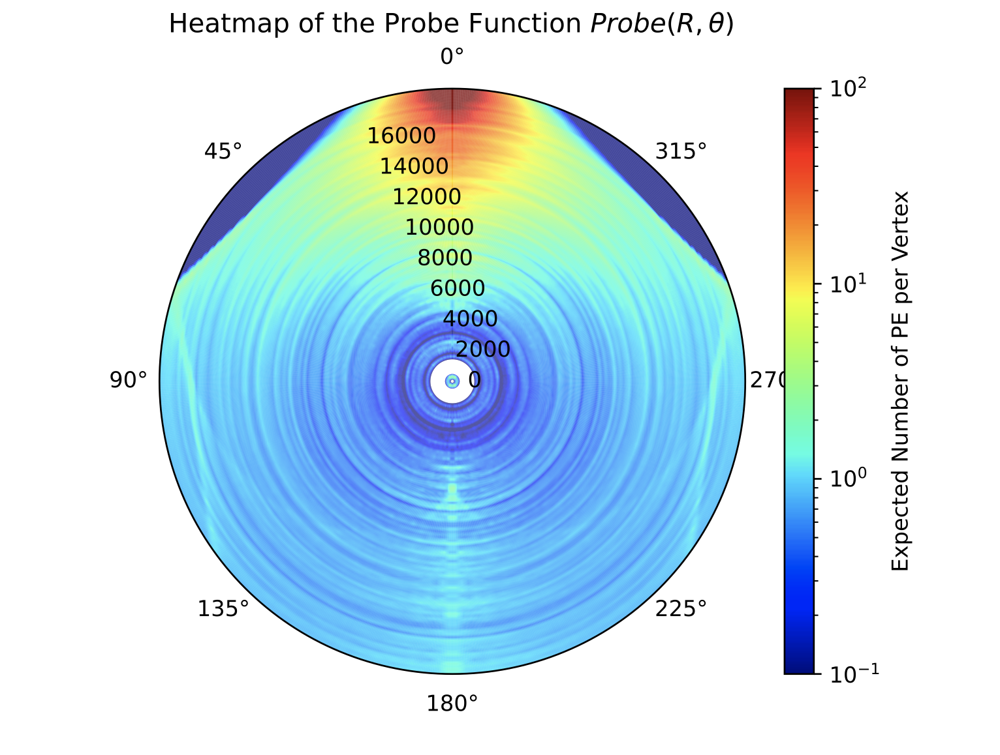
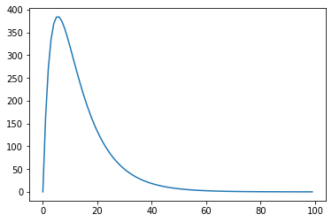
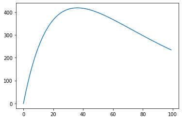
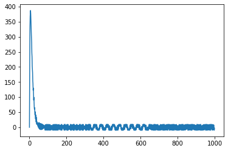
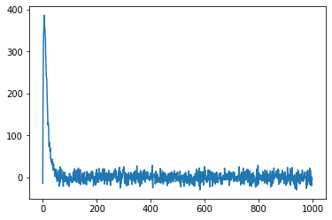

# JUNO模拟与分析实验报告

**Team: PMTSmasher**

**Members: 沈若寒 刘明昊 赵海萌**

**小组主要分工：**

- 沈若寒：光学过程
- 刘明昊：顶点模拟与光子生成
- 赵海萌：绘图与波形生成


## 摘要

本项目以JUNO中微子探测装置为背景，对顶点模拟、光子生成、光学过程、PMT波形生成进行了建模与算法实现。通过创新性的算法设计与架构优化，我们在保证算法高精度的前提下，将算法运行速度大大提升，实现了在笔记本上以2分钟左右的时间完成除波形外的所有任务，10分钟左右的时间完成全部任务的效果。同时，根据模拟数据绘制出的图像很好地反映了算法的可靠性。

## 目录

[TOC]

## 整体思路

本项目由四个部分组成：顶点位置与光子生成，光学过程，波形生成与采样，以及绘图。

- **顶点位置与光子生成**：顶点位置先由球坐标生成，$r$的概率分布函数是平方正比，$\theta$和$\phi$均为均匀分布，然后换成笛卡尔坐标。光子的生成由非齐次泊松采样给出。只考虑顶点产生后$500\text{ns}$内产生的光子。先通过`scipy.integration.quad`构造非齐次泊松分布的期望$\lambda(t)$，事先算好归一化系数，然后每隔$1/\text{PRECISION}$采样一个点，在使用到时按照线性插值。先给出$\lambda(t)$的最大值$\lambda^{*}$，按照$\lambda^{*}$的齐次泊松过程进行取样，然后再以$\lambda(t)/\lambda^{*}$的概率保留，得到光子的生成时间。经过优化可以在笔记本上于1min内完成计算。
- **光学过程**：模拟光子的具体传播过程。由于内存限制，将总的4000个事件分10次处理。先随机生成光子的传播方向$(\theta, \phi)$，然后跟踪光子，计算入射角，按照菲涅尔公式计算反射、折射概率。因为只考虑一次反射，因此只要出现反射，就不考虑之后的反射。在考虑光子打到哪个PMT上时，我们在PMT可能与光子碰撞的区域内插入点，使用时间复杂度为$O(\log n)$ 的 `kdtree` 算法来判断这些点距离哪个PMT最近，及其距离。找出第一个出现距离小于PMT半径的点，就找到了光子具体打到了哪个PMT。经过优化可以在笔记本上以1min左右的时间内完成处理。
- **波形生成与采样**：我们唯象地采取双指数函数作为波形，实现了两种不同的噪声：正弦噪声和Gauss噪声。对于相同Event相同Channel的波形，对其波形进行叠加。为了节省内存、高效处理，我们实现了多线程的文件分块写入。为了方便不同Event的实验比较，我们还实现了噪声的控制变量功能，开启时可以在保证Channel-wise噪声随机的前提下，使Event-wise噪声精确相同。经过优化可以在笔记本上以7min左右的时间完成处理与文件写入。
- **绘图**：为了检验算法的正确性，我们绘制了三幅图：顶点体密度随半径的分布图、光子击中PMT的时间分布图以及Probe函数图，分别用于检验顶点生成、光子传播时间计算以及光学过程。我们设计出了易于阅读的图表形式，同时通过插值生成了高清晰度的Probe函数图，并用两种方法（Data-driven与Sim-driven）绘制，可以进行交叉验证。

## 0. 文件结构与执行方式

### 0.1. 文件结构

本项目的文件结构如下：

```
|-- project-1-junosap-pmtsmasher
    |-- geo.h5
    |-- Makefile
    |-- draw.py
    |-- simulate.py
    |-- scripts
        |-- __init__.py
        |-- drawProbe.py
        |-- event.py
        |-- genPETruth.py
        |-- genWaveform.py
        |-- getProbTime.py
        |-- utils.py
    |-- report.md
    |-- docs
    |-- figs
```

其中 ```geo.h5``` 为JUNO的PMT位置数据， ```Makefile``` 文件定义了文件处理Pipeline， ```simulate.py``` 和 ```draw.py``` 分别完成模拟与绘图的功能， ```scripts``` 文件夹下的各文件完成各个子功能， ```report.md``` 和```figs``` 文件夹为本实验报告及其所用到的样图， ```docs``` 文件夹下存储了本项目的要求文档。

### 0.2. 执行方式

在项目目录下用 ```shell``` 执行代码

```shell
make
```

可以完整地执行整个项目的流程，生成模拟数据文件 ```data.h5``` 并根据该数据绘制图像 ```figures.pdf``` 。

执行代码

```shell
make data.h5
make figures.pdf
```

可分别生成模拟数据 ```data.h5``` 和绘图 ```figures.pdf``` 。

执行代码

```shell
make clean
```

可以清理生成的 ```data.h5``` 和 ```figures.pdf``` 文件。

若要单独测试 ```simulate.py``` 和 ```draw.py``` ，可以执行

```shell
python3 simulate.py -n <num_of_events> -g geo.h5 -o <output_file> [-p <num_of_pmts>]
python3 draw.py <data_file> -g geo.h5 -o <output_file>
```

例如：

```shell
python3 simulate.py -n 4000 -g geo.h5 -o data.h5
python3 draw.py data.h5 -g geo.h5 -o figures.pdf
```


## 1. 顶点模拟与光子生成

### 1.1. 思路

题目要求顶点的位置在球中均匀，使用笛卡尔坐标系不容易保证这一点，但由于球具有的对称性，球坐标生成顶点位置是更方便的。因此，我们先生成球坐标位置$(r, \theta, \phi)$，再改成$(x,y,z)$。

非齐次泊松过程的采样需要先计算期望$\lambda(t)$，这由卷积给出，无法得到很好的解析表达式。`scipy.integration.quad`运行速度虽然已经很快，但这里需要计算的期望数可能有几亿次，耗费时间太久。因此，我们采用了线性插值的方法。

非齐次泊松过程采样并不容易处理，而齐次泊松过程采样实现起来较为方便。因此我们使用了```Acceptance-Rejection Method```，先使用齐次泊松过程采样，然后使用期望值来`accept`或`reject`。

### 1.2. 实现方式

#### 1.2.1. 顶点坐标生成

通过简单的数学计算，可以得到，球坐标下如果位置分布均匀，$r$的概率密度函数应该是平方正比。由对称性，$\theta$和$\phi$是均匀分布的。使用`numpy.random.Generator.power`，将参数$a$设置为3，便可以生成范围在$[0,1]$的，概率密度平方正比的随机数。然后再乘液闪的半径，得到事件的$r$坐标。$\theta$，$\phi$由`numpy.random.Generator.random`生成，前者需要乘$\pi$，后者需要乘$2\pi$。

生成后，转成$(x,y,z)$即可。此算法的正确性证明见3.2.1节。

#### 1.2.2. 光子生成

本题中的期望函数为指数衰减与高斯分布的卷积，可以表达为以下形式：
$$
\lambda(t)=k\int_0^{+\infty}e^{-x-(t/\tau-x)/2\sigma^2}dx
$$
其中$k$为归一化系数。本题中，$\tau=20\text{ns}$，$\sigma=5$。由于题目要求，$\lambda(t)$在$[0, +\infty)$上的积分应为$10000$。数值计算得到$k=69.1504473757916$。$\lambda(t)$的图像如下图所示：



泊松过程采样有两种思路：第一种是确定事件的个数，采样时间；第二种是确定总时间，模拟事件在一段时间内的发生。考虑到实际情况，每个顶点不可能正好产生$10000$个光子，且后一个光子的产生时间会依赖于前一个光子，不适合于计算机大规模计算，因此我们不采用第一种方式，**而是使用固定总时间的方式**。

我们采用的总时间为$T=500\text{ns}$。这时候的$\lambda(t)=0.001615$，而最大值$\lambda_{\text{max}}=67.874$，因此可以忽略在此之后产生的光子。

我们先按照$\lambda(t) = \lambda^{*}$的齐次泊松分布，模拟$T$时间内的事件。采用的方法是，先使用`np.random.Generator.poisson`采一次样，给出$T$时间内发生的事件数$n$；然后在$[0, T]$区间内按照均匀分布，随机生成$n$个随机数，使用`np.sort`来排序。排序后，每个随机数代表一个事件发生的事件。

在齐次泊松过程取样后，对每一个事件，按照$\lambda(t)/\lambda^{*}$的概率保留，就得到了最后保留的光子生成时间。这一取样过程中，两个光子生成时间不存在依赖，因此能够很好地并行化。

由于使用了齐次泊松过程取样，第一阶段产生的事件数期望值为$\lambda_{\text{max}}T$，约为34000次。如果要模拟4000个事件，就要计算**1.36亿次**$\lambda(t)$。然而，$\lambda(t)$由积分得到，每次积分需要耗费$10\mu \text{s}$数量级的时间，这个时间花费是不能够接受的。考虑到我们不需要得到很精确的$\lambda(t)$值，我们采用了线性插值的方法，每隔$1/\text{PRECISION}$取一个点，一般$\text{PRECISION}$取1000。

在程序中，将光学过程中使用的光速$c$改成$3\times 10^{8}{m/ns}$，就可以忽略传播时间的影响，**PETime**给出原始的泊松采样得到的生成时间。~~（别问我为什么改成这个值，都是单位惹的锅）~~改动后，`figures.pdf`的第二张图如下，可见与$\lambda(t)$的图像一致，说明此算法的正确性。



## 2. 光学过程

### 2.1. 思路
实验中产生的光子总数约为4000w，且没有相互之间的依赖作用，这是最适合计算机并行操作的任务。因此，我们决定并行地模拟每个光子的光学过程，最终给出PETruth。

### 2.2. 实现方式

#### 2.2.1 光子的编码
一个光子由如下的信息所确定：坐标矢量，速度矢量，从产生至今的时间，由哪个事件生成，以及“一次反射”假设带来的能够反射历史记录。为了并行化处理光子，我们将n个光子的信息存放在一起。它们具体的实现方式如下：

**```coordinates, velocities```**：(3, n)型ndarray，其中(i, j)元素表示第j个光子的第i个坐标/速度分量（每个velocities矢量(:, j)都是归一化的，方便后续计算）

**```times, events```**：均为(n,)型ndarray，其中(j)元素表示第j个光子的时间/产生于哪个事件

**```can_reflect```**：(n,)型ndarray，其中(j)元素表示第j个光子接下来能否进行反射


#### 2.2.2. 液闪边界过程
所有产生的光子最初都在液闪内，而必须到达液闪边界进而决定下一步的行为。光子在边界上的行为可能有：折射，反射。首先应当考虑的是全反射，当入射角小于$\arcsin(n_{\text{water}}/n_{\text{LS}})$时发生，此时光子完全反射，没有任何透射的可能。考虑到波动光学，波动性的光有透射系数与反射系数，表示光线的强度。在我们的光子模型中，每个光子的强度都是一样的，数量也是守恒的，不能凭空增加，因此**透射系数**与**反射系数**在此处解释为单个光子发生**透射**与**反射**的概率。由于我们模拟的光线是完全随机无偏振的，因此单光子的偏振效应为两种线偏振的平均。

在具体实现中，大部分操作都通过矢量计算而完成，因为矢量计算的速度远快于三角函数。下述计算都基于假设各个方向矢量是归一化的，而我们的速度矢量约定就是为了满足这个条件。假设入射光为$i$，出射光为$t$，反射光为$r$，法向矢量为$n$指向入射光一侧，那么通过简单的空间几何知识就可以计算出：
$$
t = \frac{n_i}{n_t}i - (\frac{n_i}{n_t}(i\cdot n)+\sqrt{1-(\frac{n_i}{n_t})^2(1-(i\cdot n)^2)})n\\
r = i - 2(i\cdot n)n
$$

而对于透射/折射系数，并没有简单的矢量方法，而只能计算出角度再计算。角度计算牵涉到 $\arccos$ 函数，存在有限长的定义域。虽然理论上我们的角度余弦都是合理的数值，但是由于浮点数计算的误差可能会使得结果超出定义域，因此需要 ```np.clip``` 函数来保证运行。

#### 2.2.3. 打击PMT
一次计算的光线在 $10^4\sim 10^5$ 的数量级，而PMT数量为17612。我们的目的是求出每个光子最终能击中哪个PMT，而这个问题可以简化为：光子在 $R=19.5\text{m}$ 的球面上对应的点，距离哪个PMT的中心最近。如果暴力计算每根光线与每个PMT的距离，那么复杂度是$O(n)$，对于4000w光子是不可接受的。因此，我们采用了KDTree算法，将复杂度简化为$O(\log(n))$。

找到了目标点并不意味着光子一定能击中这个点，为此还需要计算光线到这个PMT的具体距离，给出**allow**表示光子能否击中对应PMT。

对于这些能够击中PMT的光子，我们才因为有必要计算它们具体击中的时间。然后交给**write**函数写入**PETruth**表。

#### 2.2.4. 写入PETruth

每次击中PMT就需要立刻写入PETruth。这种需要长度经常变化的容器，我们选择了list而非ndarray，因为后者每次append时都需要重新分配内存，浪费大量资源。

### 2.3. 仍然存在的问题

对于对称性特别好的光子，比如从$(0, 0, 0)$点出射的光子，它的入射角是0（或者极小）。通过极限的知识我们能够算出它的透反射系数，但是```numpy```无法处理0入射角因而会报错。幸好模拟出的光子在中心的概率极小，我们尚未遇到因此而报错的情况。


## 3. 绘图

### 3.1. 思路

**绘图** 是相对较为独立的一项功能，且具有与其余代码交叉验证的功能，因此我们在项目初期建立了 *Git Branch* **draw** 完成了该功能的初步实现。在使用 *GhostHunter 2021* 的数据集简单检验了代码的正确性后，我们将其 *Merge* 入 **master** ，并应用于辅助验证及调试项目其余功能的实现情况。在顶点模拟与光学过程的功能完成后，我们利用完整生成的data.h5对绘图功能进行了进一步地调整和优化：重构了代码结构，调整了图表外观，利用插值增加了图标的分辨率，使其更易阅读。

具体来说，绘图功能在文件 ```draw.py``` 中实现，主要包括三个部分：

1. **函数 ```draw_vertices_density```** : 绘制顶点体密度随半径分布的图像，用于验证所生成的顶点是否符合均匀体密度分布的要求；

2. **函数 ```draw_pe_hit_time```** : 绘制光电子接收时间的直方图，用于展示电子在液闪中激发的光子传播到PMT上所产生的光电子在时间上的分布情况；

3. **函数 ```draw_probe```** : 绘制每个 PMT 对探测器内任意⼀点处顶点激发所产生的光子中，被该PMT接收到的光⼦产⽣的 PE 的电荷数期望（以后简称 *Probe* 函数）的极坐标热力图，用于展示光学过程对光子接受概率分布的影响。

   原则上Probe函数有两种绘制方式：独立于模拟、只利用 **PETruth** 表绘制（以后简称为**Data-driven的Probe图**）和正向模拟光子来绘制（以后简称为**Sim-driven的Probe图**）。我们分别实现了两种绘制方式，并相互交叉验证，为我们程序的可靠性提供了进一步的支持。

### 3.2. 主要实现方式

下面分别对这三个功能的具体实现方式和结果做一个介绍。完整样图请见TODO。

#### 3.2.1. 顶点体密度分布图

顶点体分布图的绘制较为简单：从 **ParticleTruth** 表中读出各顶点的直角坐标 $(x, y, z)$ ，计算得到其与原点的距离  $r = \sqrt{x^2+y^2+z^2}$ ，再利用绘制直方图的函数 ```plt.hist``` 得到顶点数随半径的分布，最后根据
$$
\rho(r) = \frac{\text{d}N}{\text{d}V} = \frac{\text{d}N}{\frac{4\pi}{3}\text{d}(r^3)}
$$
进行体密度修正，计算得到顶点体密度随半径的分布，并绘制成图。在绘图过程中，为了美观，我们将纵坐标体密度的单位设置成预期的均匀体密度 $\rho_0 = \frac{N}{V} \approx 1.72\times 10^{-10} \text{mm}^{-3}$ ，将横坐标半径的单位设置成液闪球的半径 $R_{LS} = 17.71\text{m}$ ，并在 $\rho/\rho_0 = 1$ 处绘制了参考线，使该图更易阅读，最终得到的样图如下图所示，可以看到生成的顶点在随机误涨落范围内大致复合均匀分布的要求。



**注意！** 在进行体密度修正时，不要使用 $\text{d}V = 4\pi r^2\text{d}r$ 的近似，否则会导致在顶点数较少的地方出现与真实体密度相差甚远的偏差，使用$ \Delta V = V_2-V_1 = \frac{4\pi}{3}r_2^3-\frac{4\pi}{3}r_1^3 $ ，并将 ```plt.hist``` 返回的半径 ```bins``` 取平均后作为横坐标，可以有效避免这一问题。

我们注意到，根据大数定律，顶点数密度的涨落会随着顶点数的增加而趋于消失。为了验证我们程序的正确性，我们使用同样的程序在顶点数为 $10^{8}$ 时进行了模拟，得到的顶点数分布如下图所示。可以看到顶点的体密度分布非常均匀！只是在原点附近仍有较小偏差，这是因为原点附近生成顶点的概率较小，样本较少，故涨落较大，符合我们的预期。




#### 3.2.2. 光电子接收时间直方图

光电子接收时间直方图的绘制更为简单：只需读入 **PETruth** 表，并根据接收时间 *PETime* 利用函数 ```plt.hist``` 绘制直方图即可。图的纵坐标为相应时间段内接收到的光子个数，横坐标接收时间的单位设置为 $\text{ns}$ ，最终产生的样图如下图所示。




#### 3.2.3. Data-driven的Probe函数热力图

Data-driven的Probe函数图像是绘图功能最困难的部分，主要是因为其涉及到了**大量数据的双键值索引**，即对 **PETruth** 表的 *EventID* 与 *ChannelID* 两个键值同时进行索引，并将各组PE数求和。实现这一功能最直接的方法是 ```pandas.DataFrame.groupby``` 但是其效率过低。

为了解决这一难题，我们可以利用各PMT全同的假设，将 **PETruth** 表的 *EventID* 替换为对应的坐标 $(x, y, z)$ ，将 *ChannelID* 替换为对应的角坐标 $(\theta, \phi)$ ，然后计算得到它们的相对投影极坐标，最后根据这一投影极坐标调用 ```plt.hist2d``` 计算二维直方图。 **在几何上，这等价于将所有的Event绕PMT所在轴旋转到同一个平面内，再将所有PMT绕垂直于该平面的过原点的轴旋转至同一方向，最后将对应位置的PE数求和。** 需要注意的是，这一算法依赖于数据的三个性质：

1. 各PMT可视作全同；
2. 体系绕PMT旋转对称；
3. 顶点体密度均匀。

预处理步骤的具体算法实现如下：

```python
# divide events & channels
Events, Events_i = np.unique(
  self.petruth['EventID'], return_inverse=True)
Channels, Channels_i = np.unique(
  self.petruth['ChannelID'], return_inverse=True)

print('Replacing Event & Channel with xyz & geo')

# replace ChannelID with corresponding geo
geo_Channels_i = np.array(
  [np.where(self.geo['ChannelID']==a)[0][0] for a in Channels])
pet_geo_i = geo_Channels_i[Channels_i]
pet_geo = np.stack([
  self.geo['theta'][pet_geo_i] / 180 * np.pi,
  self.geo['phi'][pet_geo_i] / 180 * np.pi ], -1)

# replace EventID with corresponding xyz
xyz_Event_i = np.array(
  [np.where(self.simtruth['EventID']==a)[0][0] for a in Events])
pet_xyz_i = xyz_Event_i[Events_i]
pet_xyz = np.stack([
  self.simtruth['x'][pet_xyz_i],
  self.simtruth['y'][pet_xyz_i],
  self.simtruth['z'][pet_xyz_i]], -1)

# raplace xyz, geo with polar coordinates
pet_polar = np.stack(
  polar_from_xyz(Ro,
                 pet_geo[:, 0],
                 pet_geo[:, 1],
                 pet_xyz[:, 0],
                 pet_xyz[:, 1],
                 pet_xyz[:, 2]),
  -1)

```

预处理完成后，我们得到了PE数在极坐标上每个 $(\text{d}r, \text{d}\theta)$ 小格上的分布，而我们想要绘制的是每个顶点产生的PE数期望。由于顶点体密度均匀，故其在极坐标上的分布并非均匀，因此需要根据公式
$$
\text{Probe}(r, \theta) = \frac{\text{d}N_{PE}}{\text{d}N}
=\frac{\text{d}N_{PE}}{\text{d}V}\frac{\text{d}V}{\text{d}N}
=\frac{\text{d}N_{PE}}{2\pi r\sin\theta\rho_0\text{d}r\text{d}\theta}
$$
做出修正，最后利用 ```plt.pcolormesh``` 绘制出热力图即可。

**注意！** 调用 ``` np.meshgrid``` 和 ```plt.pcolormesh``` 进行绘图时，需要注意 $r$ 方向与 $\theta$ 方向在传入函数时的顺序，否则容易得不到正确的图像。由于修正公式中分母出现了 $r, \sin\theta$ ，在执行 ```plt.hist2d``` 计算直方图数据时，需要避开 $r=0, \theta = 0, \pi, 2\pi$ 附近的点。

为了提升图像的分辨率，我们利用 ```scipy.interpolate.interp2d``` 进行了插值。同时为了更方便与同行比较，我们采取了对数着色，并选用了 **cmap**  *Jet* 。最终的样图如下图所示。完整高清大图（30M）请见 [PDF: Data-driven Probe](./figs/probe_data.pdf) 。



注意到，该图左右上角位置Probe很小，代表着 **全反射** 区域；同时Probe函数随着距离PMT的位置增长而衰减（ $0\degree$  附近的红黄青渐变区域），对应着光子传播过程中 **平方反比** 的衰减；而图像下半部分的蓝色亮线，则代表着 **一次反射与折射** 等光学过程。另外，我们注意到图像呈现出关于半径的圆环图样，同时接近原点处出现空白，这是由于生成的Event数量较少（4000个），在随机涨落的影响下，Event数量较少的半径处会变暗，这也是Data-driven的Probe函数热力图的缺点，它受制于数据的随机性，而下一节所述的Sim-driven的Probe函数热力图则可以避免这一现象。

#### 3.3.4. Sim-driven的Probe函数热力图
通过模拟顶点均匀发出光子来计算该点光子能到达PMT的概率。这部分的光学设计与前面的光学设计不同的是：
1. 光子是不确定的，只有发出光子的位置是确定的
2. PMT的数量只有一个，无需考虑17612个

因此，光学模拟的难点也随之改变。

##### 3.3.4.1. double_search算法
考虑一个最简单的情况，顶点位于中心，PMT位于 $(0, 0, 19.5)$ 处。不考虑折射（如果有的话，入射角趋近于0， 透射率也有0.997），那么能击中PMT的概率则约等于PMT在顶点看来的立体角，这个立体角的大小约为 $4.2\times 10^{-5}$ 。如果我们只模拟10000条光线，那么最小的粒度为 $10^{-4}$ 远大于真实的概率，因此最后的状态只有 $10^{-4}$ 或$0$两种——这是不能接受的。这个问题的根本在于，我们发出的试探光线大部分都是无用的。

因此，这部分的难点在于：如何选取发射的光线，以提高命中率；同时又保证发出光线的随机性？为此，我们设计了**double_search**算法。

这个算法double在于：对于一个顶点，会发射两次光线，第一次粗侧，在所有方向上随机发出光子，确定大概能射中PMT的范围，这部分范围占总立体角的比例为$\text{ratio}_1$；第二次细测，在第一次选定的范围中均匀发出高命中率的大量光线，命中的光线占发出光线的比例为$\text{ratio}_2$；最终，总的概率就等于$\text{ratio}_1 \times \text{ratio}_2$。这样做能够大大增加精度。

对于用光线模拟光子的行为，由于计算的是期望值，我们认为光线的强度可以代表光子做这一行为的概率。每次初始发射的光线都是等强度的。

##### 3.3.4.2. 粗测算法
粗测算法的目的，是给出距离PMT很近的光线。此处的*距离*定义为：PMT中心到光线射线的距离，如果光线朝反方向传播到达不了最近点，则给出负值。我们需要设定一个上限，然后选取距离小于这个上限的光线。对于不同的顶点位置，可能接近的光线会有数量级的差异，因此我们需要自动化调整这个上限，使得接近的光线处于一个合理的范围：既能够包含PMT，又不至于太大而降低命中率。对于调大上限至一定水平仍无法获得足够光线的顶点，可以认为它无法击中PMT，直接返回概率0。实际算法中我们调节$d_{max}$使得允许的光线数大于**least_allow_num**，后者是一个经验参数，与发出的试探光线数有关。

选取完光线之后，我们还需要对光线进行编码。这里所使用的是常见的球极坐标，并使用了预转动来让光线可能的区域落入坐标合适的地方（取消$\phi$的多值性）。

##### 3.3.4.3. 细测算法
细测算法的核心在于，如何在有限区域内均匀发射光线。这里采用的方法是等概率密度法，对于$\theta$先均匀生成再取 $\arccos$ 即可保证概率密度与球面完全随机相同。在仔细选择**least_allow_num**后，高概率区的命中率可以达到$10\%$以上。

## 4. 波形生成

### 4.1. 思路 

波形生成任务主要包括根据 **PETruth** 表中每个PE的 *PETime* 绘制出相应的波形，并对具有相同 *EventID* 相同 *ChannelID* 的波形进行叠加。具体说来，包括三个部分：

1. 波形函数：根据 *PETime* 生成对应时间的波形；
2. 噪声函数：模拟电子学噪声；
3. 波形叠加：将 *EventID* 相同 *ChannelID* 相同的波形叠加；

而在实现过程中，由于生成得到的总 **Waveform** 表非常大，保存成 ```data.h5``` 文件时大约要占据 **40G** 的空间（4000顶点），这也导致内存不足以支撑对整个 **Waveform** 表的一次性处理，因此还面临第四个难题：

4. 性能优化：多进程处理与文件写入。

### 4.2. 主要实现方式

波形部分的功能在文件 ```scripts/genWaveform.py``` 中实现。

#### 4.2.1. 波形函数

对于模型函数，我们唯象地用一个双指数函数来建模，对于一个 $0$ 时刻激发的波形，有
$$
\text{Waveform}(t) = \cases{
A\exp(-\frac{t}{\tau_d})\left(1-\exp(-\frac{t}{\tau_r})\right), t>0,\\
0, t\le 0.
}
$$
这个波形的大致图像为（取 $A=1000, \tau_d = 10\text{ns}, \tau_r = 5\text{ns}$ ）



通过公式分析以及尝试，我们发现参数 $\tau_d$ 主要决定了整体波形的宽度和衰减速率，如增大 $\tau_d$（取 $A=1000, \tau_d = 70\text{ns}, \tau_r = 5\text{ns}$ ）可以得到一个更宽、衰减更慢的波形：


而参数 $\tau_r$ 则主要决定了峰值的位置，如相比上图增大 $\tau_r$ （取 $A=1000, \tau_d = 70\text{ns}, \tau_r = 30\text{ns}$ ）可以得到一个更偏右的峰值：



在实验中我们选取了 $\tau_d=10\text{ns}, \tau_r=5\text{ns}$ ，函数的设计允许不同参数的选取，可以修改生成相应的数据。

另外为了优化加速，我们采用了 ```numexpr``` 包进行加速，具体实现如下：

```python
def double_exp_model(t, ampli=1000, td=10, tr=5):
    '''
    双指数模型 f(t; ampli, td, tr)

    输入: t, 时间;

    参数:
    ampli=1000, 波形高度;
    td=10ns, 控制整体衰减时间;
    tr=5ns, 控制峰值位置;

    返回:
    f(t) = ampli*exp(-t/td)*(1-exp(-t/tr)), t > 0
           0,                               t <= 0
    '''
    return ne.evaluate(
      '(t > 0) * ampli * exp(- t / td) * (1 - exp(- t / tr))')
```

在同时计算 $10^4$ 个波形时， ```numexpr``` 比纯 ```numpy``` 快6倍左右（使用 ```%timeit``` 测得 ```numexpr``` 用时 $(38.9 \pm 0.5)\text{ms}$ , ```numpy``` 用时 $(251 \pm 4)\text{ms}$  ）。


#### 4.2.2. 噪声函数

我们实现了两种不同的噪声函数： **正弦噪声** 和 **Gauss噪声** 。综合考虑了计算速度和模拟效果，我们最终选择了后者作为默认的设置。

**正弦噪声** 采用周期无理的正弦函数的采样，保证了噪声函数在很大的区域内积分趋于零，通过调整周期参数，我们最终选取了周期 $T = \pi \times 10^{-30}$ 的正弦函数，而其振幅 $A_\text{sin}$ 由额外参数 $\text{ratio} = \frac{A_\text{sin}}{A}$ 控制。其图像大致如下（ $\text{ratio} = 0.01$ ）：



**Gauss噪声** 由于正弦噪声受其周期性的制约，并不能很好地模拟随机的电子学噪声，故我们默认采用了利用 ```numpy.random.normal``` 按Gauss分布随机抽样的噪声。为了保证其长时间积分趋于零，我们取其均值为零，并用额外参数  $\text{ratio} = \frac{\sigma}{A}$ 控制其标准差 $\sigma$ 。其图像大致如下（ $\text{ratio} = 0.01$ ）：




#### 4.2.3. 波形叠加


## 5. 优化经验总结

### 5.1. 大体思路

从最初的嘻嘻嘻，到现在在笔记本上能20分钟内跑完全程，我们团队为之付出了大量的努力。在无数次失败后，我们总结出了一些优化上的经验。优化不是乱调包，而需要遵循一定的规律逐步前进。当然最重要的，Premature optimization if evil of everything，先跑起来再谈优化.

### 5.2. 架构与算法

整个程序的架构是对性能影响最大的，远大于其它细节。一个好的架构不仅性能卓越，更是会拥有良好的扩展性。以这次JUNO大作业举例，我们最初打算先计算好Probe函数（以为能用简单的方法计算出来），再应用到每个event上（double_search算法就是在那时设计出来的，现在沦落为专用画图函数）。经过数次优化后，整个光学时间能控制在5分钟以内，3700w光子打击PMT只需要3s计算时间更是令人大跌眼镜。但是这个架构的问题在于：

1. 所有的概率都是不精确的，要想提高精度必须以$O(n^2)$的复杂度增加精度
2. 由1导致一个光子打到所有PMT上的概率之和>1，甚至可能达到1.2
3. Probe函数只能给出光子与1个PMT的关系，无法完成Bonus中PMT反射到PMT的过程
4. 应用到3700w光子的Probe函数由插值得到，但真实计算double_search要模拟的光线太多，其实已经远超3700w
5. 以及，要判断每个究竟击中哪个PMT来生成PETruth，这个步骤非常耗时间

上述的2与3点导致我们最终放弃这个架构，转而跟踪每个光子。追踪光子的架构完美地解决了以上四个问题：

1. 只有折射与反射的过程有概率，其它过程没有任何试探或随机
2. 一个光子要么打中PMT要么没有，光子数不会增加
3. 追踪光子可以同时考虑与17612个PMT的关系
4. 就算考虑那么多关系，要模拟的光线数还是远小于计算Probe函数
5. 追踪完就可以写PETruth，无需重新判断

确定了架构，接下来就是算法。追踪光子的难点在于要考虑一个光子究竟能射中17612个PMT中的哪一个，以及复杂的几何关系。如果像原来那样计算距离来判断能否击中，其开销是$O(n)$量级的，追踪10000光子就会占满我的内存。因此，我们在调研之后使用了``scipy.spatial.KDTree``算法，将复杂度降低至$O(log(n))$，一次能追踪4000000光子。当然KDTree不是万能的，具体的魔改请看Bonus3的介绍。总而言之，算法对于性能的改善是十分显著的，远大于对过程细节的优化。

快速的算法的宗旨，应该是“在一个指令内做更多的事”。因此即使Numpy有时用不满多核，速度也比多进程快。

### 5.3. Multiprocessing

当然，并非所有的算法都能完成Numpy化，比如我们的double_search。在这种情况下，强行多进程，用满核心确实能显著提高性能，比如$2\sim3$倍，但远小于纯Numpy化带来的提升，可能有几百倍。而且多进程也存在它的问题：

1. 进程调度需要开销
2. 进程数目难以选择，processes=cpu_count()很有可能造成堵塞，反而降低性能
3. 对CPU敏感，在我们的测试中AMD处理器能承载的 进程/核心数 比小于Intel处理器
4. 通信复杂，且容易报错，比如我们的Waveform生成就出现过队列爆满导致整个程序被kill

因此，multiprocessing擅长处理的是难以Numpy化，且不太需要通信的任务，将其强行并行化。

### 5.4. Numba

再接下来需要考虑才是Numba。Numba能实现jit，优化简单代码的速度，对部分代码还能使其并行计算；缺点在于要把代码改成能通过Numba的形式需要做大量的工作，而性能提升可能并不显著。比如我常用的```np.einsum```，```np.clip```Numba就不支持，所以只能把它们替换成其他函数。如果是本身就很快的代码，加上编译用时的总时间可能比无Numba版还慢。

我们唯一一次有效地使用Numba是在老架构中增速生成PETruth的for循环，增速了两倍。这个任务是纯赋值，但是难以并行，因此只能硬碰硬地加速每一个循环。但这个行为在更改架构后自动消失了，没有地方再有丑陋的for循环。

### 5.5. 细节

剩下的都是更细枝末节的工具，可能优化了半天也只能提速10%。比如用```np.einsum```简化``np.sum+np.prod``，用``numexpr``来处理复杂表达式，减少中间过程。绝对不应该在过早的时间将精力花在这种事情上，这只能锦上添花，不可能雪中送炭（指把一天跑不完的程序优化到20分钟内）。

### 5.6. 分析工具

一个简单好用的工具是``timeit``。当你确定了数据的大小，而不知道哪种方法更快时，可以迅速地在ipython中用``timeit``测量两种方法的速度，而无需用``time.time``加上for循环。

对于更加复杂的函数，可以用``cProfile``和``line_profiler``来分析每个函数、每一行的用时。我们的程序每个函数执行功能较多，用``cProfile``粒度太粗，但其实还是用它用得多，因为把最大头的几个函数优化了速度就已经非常快了（


## 6. 加分项目

